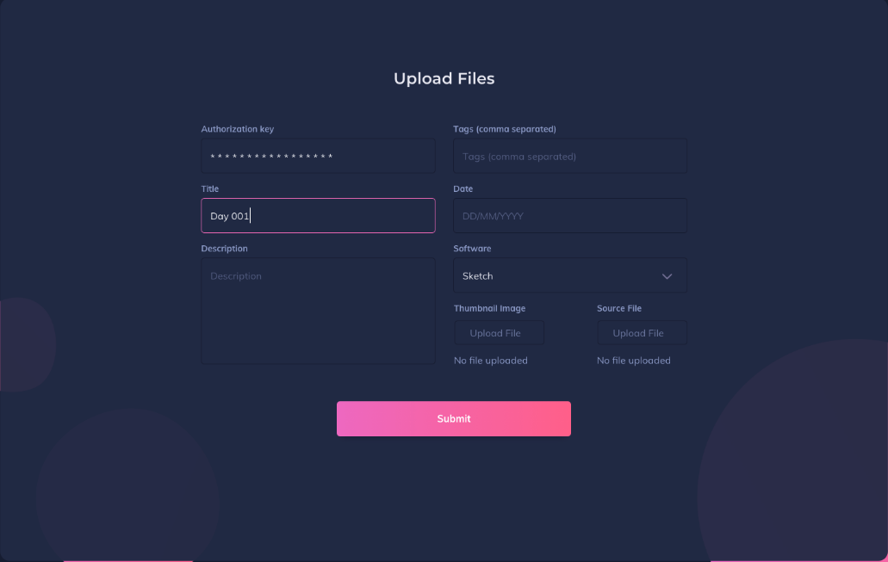

https://pickr-photo.herokuapp.com/

### Scope 
The Project is a photography database/library.
Users will be able to upload and display personal photos and have them displayed by most recent.
The site will have CRUD functionality on both 'photos and photographers' models.

1. User can create a new photo by uploading it
2. User can edit photos 
3. User can delete photos
4. User can search for photos by title, name of photographer, date shot/posted(stretch)

### Tech Stack
- Javascript
- Node.js
- Express
- MongoDB

### Install Instructions
- Clone this repo
- npm i
- touch .env, add MONGODB_URI, PORT and SECRET values
- npm start (use nodemon)

### Wireframes

### Font
The fonts I decided to use are 
[Lato](https://fonts.google.com/specimen/Lato?query=Lato "Lato")

[Baloo 2](https://fonts.google.com/specimen/Baloo+2?query=baloo "Baloo 2")

### Style Inspiration

### Figma Style Guide
As usual, I decided to create the main pages of the site on Figma first!

### MVP
- CRUD functionality on at least 1 model
- Basic creation of photos by upload
- Basic Styling
- Being able to add photographers 

### Milestones
- Sprint 1
1. File structure set up
2. Models created
3. Database connected and working

- Sprint 2
1. User can create photographer, edit and delete
2. Search for photographer

- Sprint 3
2. Render photo
3. Search for photos

- Sprint 4
1. Final styling

- Sprint 5
1. Testing
2. Deploying
